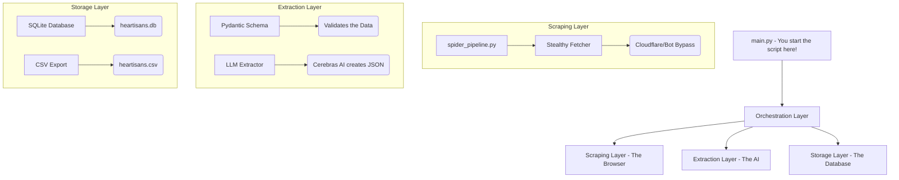

# Heartisans Architecture Manual
*(A beginner-friendly breakdown of how the web scraper thinks and breathes!)*

---

## 🛠️ High-Level Overview

Imagine you want to buy 10,000 different antique items from around the world, taking notes of their material, origin, and price. Doing that manually would take months! 

The **Heartisans Autonomous Data Pipeline** is designed to do all of this for you. It sits on top of a highly optimized web browser engine (called **Scrapling**), grabs all the important data from the page using **CSS Selectors**, and then asks a super-smart **Artificial Intelligence (LLM)** to cleanly organize that data into an Excel spreadsheet format or a Database.

Let's look at the "Brain" of the software!

---

## 🏗️ Architecture Diagram

---

## 🚀 The Three Main Layers

### 1. The Scraping Layer (The Eyes)

This layer is responsible for physically going to the websites and downloading the text you need without getting banned.

- **`spider_pipeline.py` (The Heartbeat)**: This script controls what websites get loaded and which links are followed. Think of it as the driver of a car. It queues up a "quota" of links (say 100 links per website) and then clicks on them concurrently. 
- **Bypassing Bots**: The scraper runs "Headless" (invisible browser tabs). It acts natively like a human to avoid Cloudflare blockers!

### 2. The Extraction Layer (The Brain)

Once we download the product page (for example, a page selling an antique vase), we need to extract 15 specific facts from the messy code.

- **CSS Targeting**: Instead of giving the AI a massive wall of useless Code resulting from the website, we use targeted "CSS Selectors" (like looking for `.price`) to summarize what the AI reads.
- **`llm_extractor.py`**: This connects securely to **Cerebras Llama3** or other LLM APIs. We prompt the AI: *"Hey AI, look at this vase. Find the Price, Material, Date of Manufacture, and describe its defects."* The AI responds perfectly with structured data!
- **`validator.py`**: A strict bouncer. If the AI hallucinates a price (e.g. ₹999,999,999!) or says the price is `-10`, it throws out that piece of data to protect your dataset!

### 3. The Storage Layer (The Memory)

If the data is perfectly extracted, it's sent to storage.

- **`models.py` (Database Builder)**: Automatically structures the storage table using SQLAlchemy. 
- **`database.py`**: Inserts the product cleanly into SQLite (`.db`). Automatically appends the matching item to your Excel/Pandas file (`.csv`).

---

## 🔄 The Data Lifecycle (Step-by-Step)

Here is a step-by-step map of exactly what happens when you type `python main.py` in your terminal!

> [!NOTE] 
> This assumes you set `TARGET_ROW_COUNT=10` in your configuration (`.env`).

1. **Link Generation**: The script reads your `seed_urls.yaml` list to figure out which catalog pages to open (e.g. "https://novica.com/jewelry").
2. **Spider Queuing**: The spider quickly grabs up to 100 product links on that menu and adds them to a queue.
3. **Fetching**: The scraper rapidly visits those pages in the background natively utilizing async fetchers so it doesn't freeze your computer. Let's say it checks *Item #1*.
4. **AI Parsing**: The text from *Item #1* is passed securely to Cerebras. The AI finds the details and creates `ProductData` matching our required schemas.
5. **Validation Rule Check**: Did the AI find `price = ₹500`? 
    - **YES**: The Data is stored! The Spider counts `+1 Row`.
    - **NO (e.g. Price is missing from website)**: Validation drops the item completely! The Spider safely moves to the next link.
6. **Goal Check**: Did we reach the 10 target elements required?
    - **NO**: Keep executing and validating.
    - **YES**: Success! Shut down the browser tabs and generate the `.csv` file automatically.

---

## 🛠️ Configuration & Scaling

For beginners looking to scale:

1. **`CONCURRENT_REQUESTS=`**: Dictates how fast scripts run. Setting it to `10` pushes ~10 headless browsers safely. Only increase this if you have the RAM and processing bandwidth!
2. **`TARGET_ROW_COUNT=`**: Tells the script exactly when to log off. Setting this to `10000` is perfectly safe once configuration passes standard validation. Wait out the scraping lifecycle! Checkpoint tracking occurs automatically!
3. **SQLite**: We use `Float` for price and `String` type databases explicitly for text formatting since AI extraction might occasionally append brand ratings in different combinations via Pydantic model configurations!

---

> [!TIP]
> If you make any custom models, navigate right over to the `src/extraction/schema.py` format first! The AI needs precise rule sets to correctly fill your columns without raising red flags to extraction handlers.
